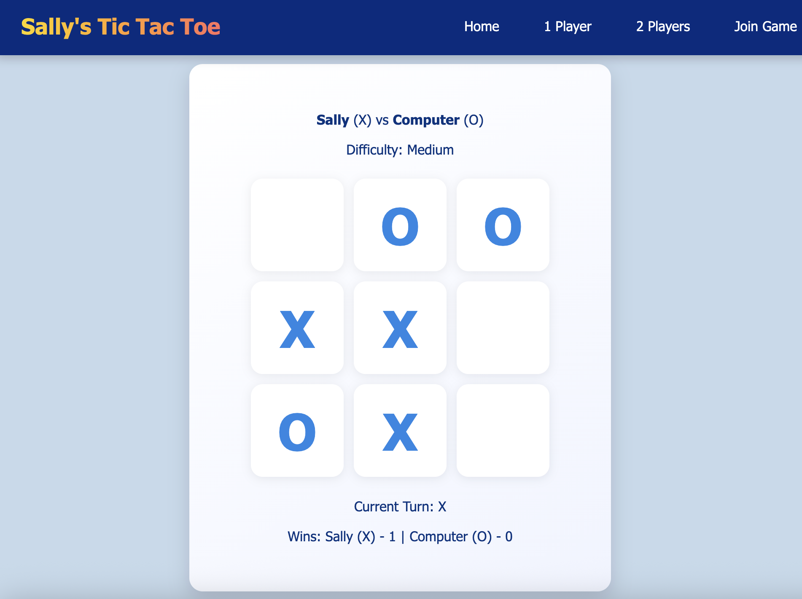

## 🎮 Tic Tac Toe – Flask Web Game

A full-stack Tic Tac Toe web application built with **Flask**, supporting both **single-player (AI)** and **two-player multiplayer** modes. Players can compete against an AI with multiple difficulty levels or play with another user in a shared game room using a unique join code.

---
## 🌐 Live Demo
https://flask-tictactoe.onrender.com/

## 🚀 Features

### 🧍 Single Player Mode

* Play against an AI opponent
* Three difficulty levels:

  * **Easy** – Random moves
  * **Medium** – Defensive logic (win/block strategy)
  * **Hard** – Optimal play using the **Minimax algorithm**
* Win tracking across rounds
* Instant game reset

### 👥 Two Player Mode (Multiplayer)

* Create a private game room with a **unique 6-character code**
* Second player joins using the room code
* Turn-based gameplay enforced by the server
* Shared game state synced via polling (`/game_state`)
* Detects:

  * Player disconnection (inactivity timeout)
  * Player leaving the game intentionally
* Win tracking for both players
* Supports replaying without recreating the room

---

## 🛠️ Tech Stack

* **Backend:** Python, Flask
* **Frontend:** HTML, CSS, JavaScript
* **AI Logic:** Rule-based strategy & Minimax algorithm
* **State Management:** Flask sessions + in-memory game store
* **Deployment:** Render

---

## 📂 Project Structure

```text
.
├── app.py                 # Flask app, routing, game logic
├── ai.py                  # AI decision logic (Minimax, difficulty modes)
├── templates/
│   ├── base.html          
│   ├── index.html         # Mode selection
│   ├── setup.html         # Player setup
│   ├── join.html          # Join multiplayer room
│   ├── waiting.html       # Waiting for second player
│   └── game.html          # Main game UI
├── static/
│   └── style.css          # Styling
├── requirements.txt
└── README.md
```

---

## 🧠 Difficulty Modes Explained

* **Easy Mode**
  AI selects a random available cell.

* **Medium Mode**
  AI prioritizes:

  * Winning moves
  * Blocking the player’s winning moves
    Creates a more realistic challenge.

* **Hard Mode**
  AI uses the **Minimax algorithm**, guaranteeing optimal play and making it unbeatable.

---

## 🔄 Multiplayer Game Flow

1. Player 1 creates a room and receives a **join code**
2. Player 2 enters the code to join the room
3. Game state is shared and updated via `/game_state`
4. Server enforces turns and validates moves
5. Disconnections and exits are detected and communicated to the remaining player

---

## ▶️ How to Run Locally

1. **Clone the repository**

   ```bash
   git clone https://github.com/your-username/tic-tac-toe-flask.git
   cd tic-tac-toe-flask
   ```

2. **Create a virtual environment (optional)**

   ```bash
   python -m venv venv
   source venv/bin/activate   # macOS / Linux
   venv\Scripts\activate      # Windows
   ```

3. **Install dependencies**

   ```bash
   pip install -r requirements.txt
   ```

4. **Run the application**

   ```bash
   python app.py
   ```

5. **Open in browser**

   ```
   http://127.0.0.1:5000
   ```

---

## 🖼️ Screenshots

> Single-player and multiplayer gameplay



---

## 🌱 Future Improvements

* WebSocket-based real-time updates (replace polling)
* Online matchmaking (no room code required)
* Persistent game history
* Improved mobile UI animations

---

## 📌 Why This Project?

This project demonstrates:

* Full-stack Flask development
* Server-side game state management
* AI decision-making using algorithms
* Multiplayer session handling
* Clean separation of concerns between backend and frontend

---

## 👤 Author

**Tsz Wai Cheung**
Aspiring Software Developer
[GitHub](https://github.com/sally033005)

---
